# A Programmer's Introduction to Mathematics

## Chapter 2: Sets.

**Definition 2.1**  A single variable polynomial with real coefficients is a function f that takes a real number as input and produces a real number as output, and has the form:

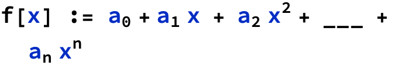

where the $a_i$ are real numbers. The $a_i$ are called coefficients of f. The degree of the polynomial is the integer n.

```wl
In[]:= Plot[Callout[x^5 - x - 1, "f(x) = \!\(\*SuperscriptBox[\(x\), \(5\)]\)-x-1", {1, -2}], {x, -1.3, 1.3}, PlotLabel -> "Figure 2.1"]
```

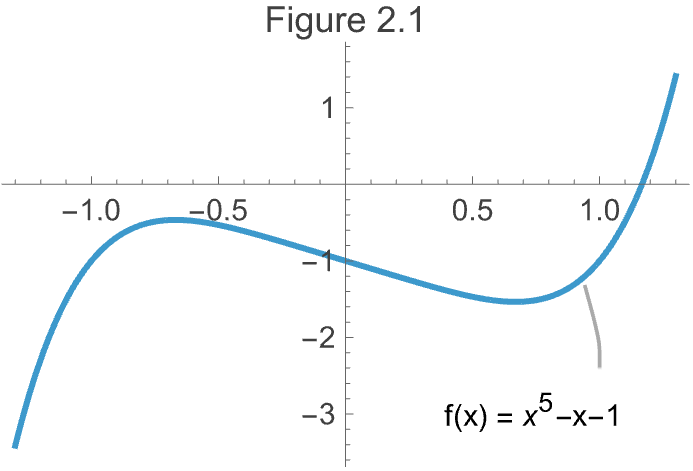

Polynomials can express all of addition and multiplication. With multiple variables you can express AND, OR, NOT if you restrict values to 0, 1.

```wl
In[]:= pAnd[x_ /; MemberQ[{0, 1}, x], y_ /; MemberQ[{0, 1}, y]] := x y;
 pNot[x_ /; MemberQ[{0, 1}, x]] := 1 - x;
 pOr[x_ /; MemberQ[{0, 1}, x], y_ /; MemberQ[{0, 1}, y]] := 1 - (1 - x) (1 - y);
```

```wl
In[]:= Grid[{{Plot[1/4 (x^3 + 3 x^2 - 6 x - 8), {x, -5, 5}, PlotRange -> {-4, 6.5}], 
     Plot[1/14 (x^4 + x^3 + -13 x^2 - x + 8), {x, -5, 5}, PlotRange -> {-4, 6.5}]}, 
    {Plot[1/20 (x^5 + 3 x^4 - 11 x^3 - 27 x^2 + 10 x + 64), {x, -5, 5}, PlotRange -> {-4, 6.5}], 
     Plot[1/100 (x^6 - 2 x^5 - 26 x^4 + 28 x^3 + 145 x^2 - 26 x - 80), {x, -5, 5}, PlotRange -> {-8, 6.5}]} 
   }]
```

|  |  |
| - | - |
| -Graphics- | -Graphics- |
| -Graphics- | -Graphics- |

**The most important cultural expectation is that when you see a definition in a text you must immediately write down examples.** The unspoken rule is that you should not continue unless you understand what the definition is saying. You aren't expected to master the concept but you should have some idea going forward as to what the words refer to.

The reason **definitions** are communicated as symbols instead of BNF or some other similar formal spec is that their **primary purpose is communicating with other humans**.

### 2.3 Existence and Uniqueness

#### Theorem 2.2

For any integer n >= 0 and any list of n+1 points $\left(x_1\right.$, $y_1$),$\left(x_2\right.$, $y_2$),...,$\left(x_{n+1}\right.$, $y_{n+1}$) in $\mathbb{R}^2$ with $x_1$< $x_2$ < ... < $x_{n+1}$, there exists a unique polynomial p(x) of degree at most n such that $p\left(x_i\right.$) = $y_i$for all i.

n=0; (0, 0), (1, 0); f(x) = 0
n=0; (0, 1), (1, 1); f(x) = 1
n=1; (0, 0), (1, 1); f(x) = x

n=1; (2, 3), (7, 4); f(x) = $a_0$ + $a_1x$

The first of two tricks I'm using below are using substitution syntax /. to replace the x, y symbols with known values. The other is using ApplySides with a lambda function to perform the same operation on both sides of of the equality. The % symbol refers to the result of the previous expression, which lets me chain these together.

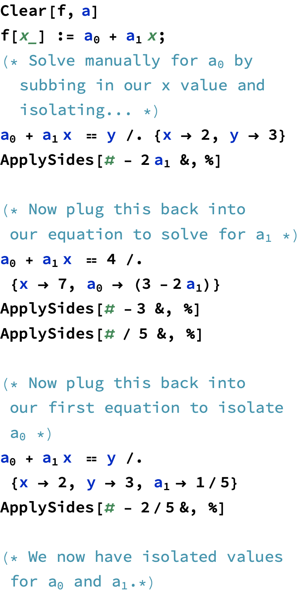

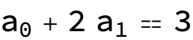

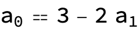

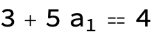

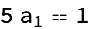

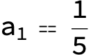

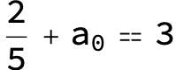

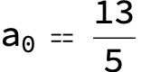

Of course we can use our CAS to solve these directly as well. Then just follow the same procedure. There is probably a way to use the rules returned from Solve directly in a substitution list but I haven't spent the time to figure it out.


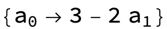

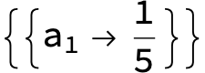

How do we know that $x_1$< $x_2$< ... < $x_n$ in our list of points? Well if $x_1$== $x_2$then we have points such as (2,3),(2,5). A degree 1 polynomial is of the form f[x] := 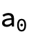+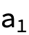x . If we go through the same solving exercise as above we'll realize we have a contradiction and get an empty solution when solving for the second variable.

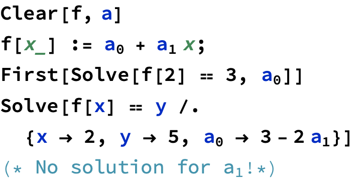


```wl
Out[]= {}
```

##### Existence of Polynomials Through Points

Starting with a single point $\left(x_1\right.$ , $y_1$) and n=0.

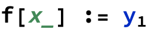

Now two points $\left(x_1\right.$ , $y_1$), $\left(x_2\right.$ , $y_2$) we construct terms that evaluate $y_i$ * 1/1 when the polynomial is evaluated at the x value corresponding to the desired y value and 0 otherwise.


```wl
Out[]= True
```

For three points $\left(x_1\right.$ , $y_1$), $\left(x_2\right.$ , $y_2$), $\left(x_3\right.$ , $y_3$) we can use a similar trick.

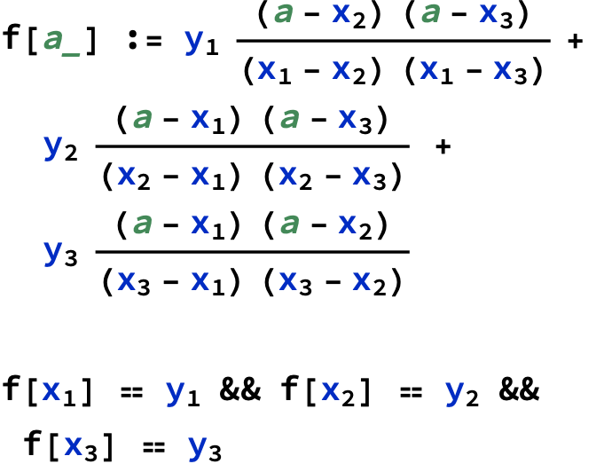

```wl
Out[]= True
```

Generalizing to a polynomial of order n...

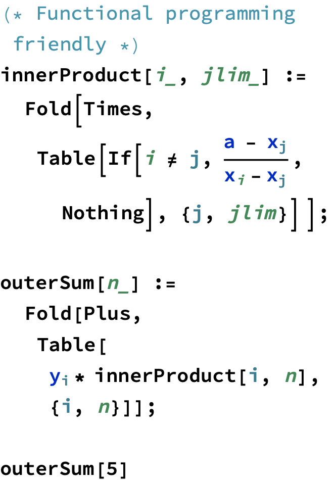

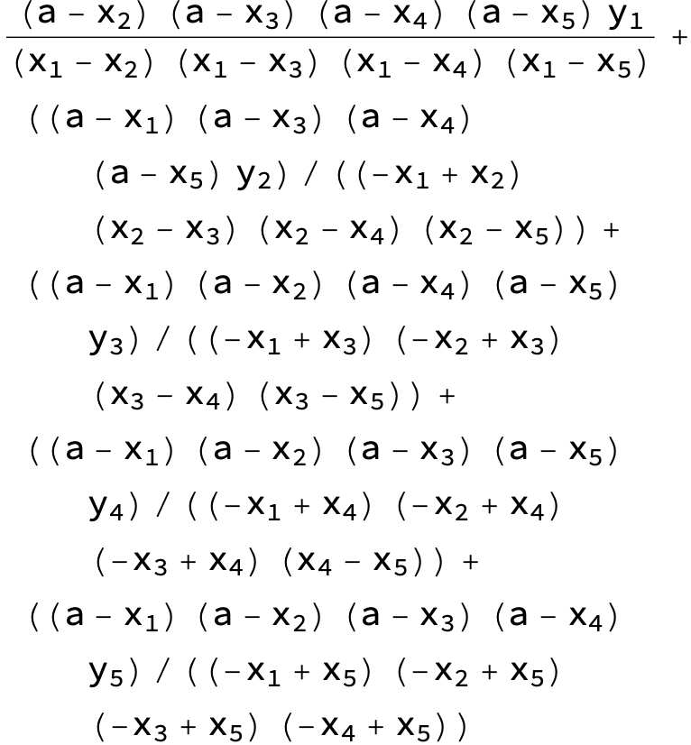

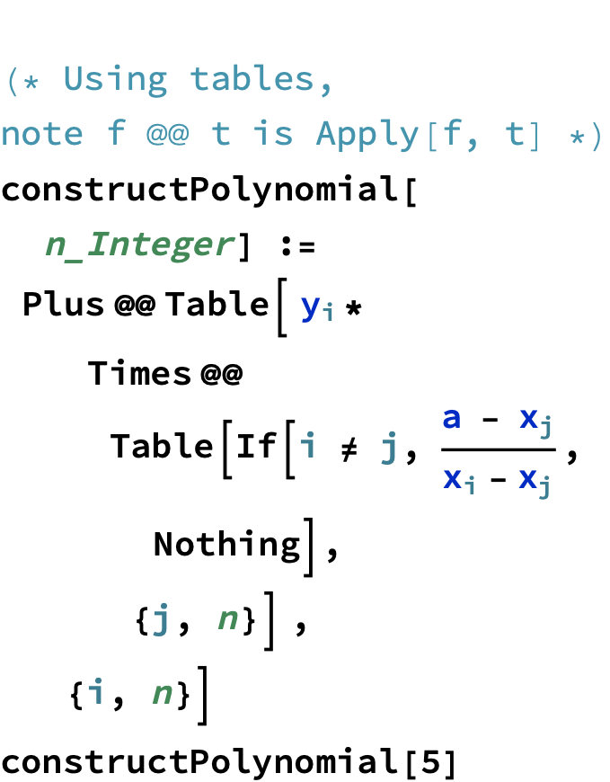


##### Uniqueness of Polynomials Through Points

**Theorem 2.3** The zero polynomial is the only polynomial over  of degree at most n which has more than n distinct roots. 

**Theorem 2.4** For any integer n >= 0 and any list of n+1 points $\left(x_1\right.$ , $y_1$), $\left(x_2\right.$ , $y_2$), ... ,$\left(x_{n+1}\right.$ , $y_{n+1}$) in $\mathbb{R}^2$ with $x_1$< $x_2$< ... < $x_{n-1}$, there exists a unique polynomial p(x) of degree at most n such that $p\left(x_i\right.$) = $y_i$for all i.

Proof. Let $\left(x_1\right.$ , $y_1$), ... ,$\left(x_{n+1}\right.$ , $y_{n+1}$) be a list of points with no two $x_i$ the same. To show existence, construct f(x) as:

$f(x) = \Sigma$ $y_i$ ( $\Pi _{j\text{!=}i}$  $\frac{x-x_j}{x_i-x_j}$)

f(x) is degree <= n because each term has degree at most n. For every i, plugging in $x_i$ causes all but the $i^{\text{th}}$ term to vanish while the $i^{\text{th}}$ term evaluates to $y_i$.

Let g(x) be another polynomial that passes through the same set of points. We will show that f = g. Examine f - g. It is a polynomial with degree at most n which has all of the n+1 values $x_i$ as roots. By theorem 2.3 we conclude that f-g is the zero polynomial, or that equivalently f = g.

### 2.4 Realizing it in Code

The [book](http://pimbook.org) contains Python code to implement this, and it is worth exploring. However my objective is to learn to use this computer algebra system (CAS) to work through problems so we'll leverage Wolfram Language's [InterpolatingPolynomial](https://reference.wolfram.com/language/ref/InterpolatingPolynomial.html).

```wl
In[]:= InterpolatingPolynomial[{{2, 4}, {4, 7}}, x]
```

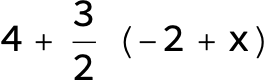

### 2.5 Application: Sharing Secrets

The secret s will be represented as an integer. Construct a polynomial f(x) such that f(0) = s. Call $a_0$, ... $a_d$ the coefficients of f. Set $a_0$= s and randomly pick the other coefficients while ensuring $a_d$ != 0. If you have n people, the shares you distribute are values of f(x) at f(1), f(2), ... , f(n).

Any k people can construct a degree k -1 polynomial g(x). We pick d = k - 1 so that a subset k people get together they can interpolate g(x). 

Say we have 5 people, and want 3 to be able to reconstruct the secret. We make f(x) of degree d = k - 1 = 2. The secret is 109.

f(x) = 109 + random * x + random * $x^2$

```wl
In[]:= Clear[f]
 s = 109;
 k = 3; p = s + Plus @@ Table[RandomInteger[5000] * x^i, {i, k - 1}]
 f[xp_] := p /. x -> xp
```

```wl
Out[]= 109 + 2834 x + 1861 x^2
```

```wl
In[]:= InterpolatingPolynomial[{{1, f[1]}, {2, f[2]}, {3, f[3]}}, x]  // Simplify
```

```wl
Out[]= 109 + 2834 x + 1861 x^2
```

### 2.6 Cultural Review

1. Whenever you see a definition, you must immediately write down examples.
2. Human to human communication is the priority.
3. We prefer the definition that is easiest to work with, and often switch implicitly.

### 2.7 Exercises

Previous exercises done on paper.

##### Exercise 2.5

A number x is called algebraic if it is the root of a polynomial whose coefficients are rational numbers (fractions of integers). Otherwise it is called transcendental. Numbers like √2 are algebraic, while numbers like π and e are famously not algebraic. The golden
ratio is the number ϕ = $\frac{1+\surd 5}{2}$ . Is it algebraic? What about √2 + √3?

First what does it mean to be the root of a polynomial? It means that f[x] = 0.

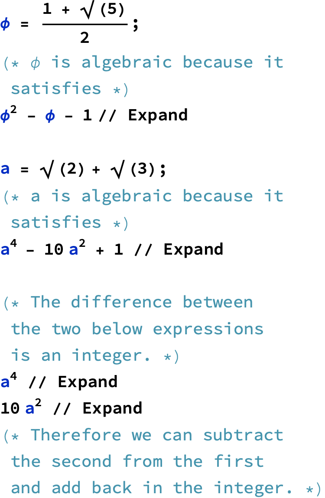

```wl
Out[]= 0
```

```wl
Out[]= 0
```

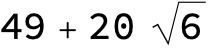

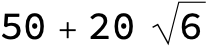

#### Exercise 2.6

**Prove the product of two algebraic numbers is algebraic. Similarly (but much harder), prove the sum of two algebraic numbers is algebraic. Despite the fact that π  and e are not algebraic, it is not known whether π + e or πe are algebraic. Look up a proof that they cannot both be algebraic. Note that many such proofs appeal to vector spaces, the topic of Chapter 10.**

x, y are algebraic. Therefore there is a polynomial f[x] == 0 and g[y] == 0;
We are seeking a polynomial h[z] such that h[x y] == 0;

```wl
In[]:= x = 2;
 f[x_] := x^2 - 4; 
  
 y = 3;
 g[x_] := x^2 - 9; 
  
 f[x y] 
  
 f[x y] - g[x y] + g[x]
 g[x y] - f[x y] - g[x] 
  (* Does the above? work with any pair of polynomials? *) 
  
 f[y] + g[x] (* Is this universal? *)
 
```

```wl
Out[]= 32
```

```wl
Out[]= 0
```

```wl
Out[]= 0
```

```wl
Out[]= 0
```

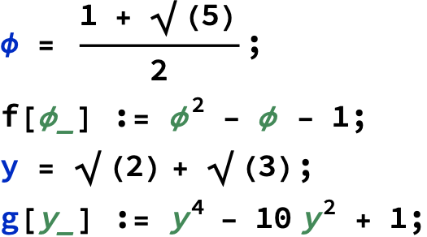

How can I prove that the product of two algebraic numbers is also algebraic?

To prove that the product of two algebraic numbers is algebraic, we need to understand what it means for a number to be algebraic and apply some properties of polynomials.  

An algebraic number is a number that is a root of a non-zero polynomial equation with rational coefficients. For a number $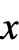$ to be algebraic, there must exist some polynomial $$ such that $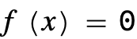$. 

Suppose $$ and $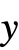$ are algebraic numbers. This means there exist polynomials $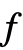$ and $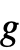$ with rational coefficients such that: 
• $$
• $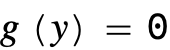$
To show $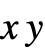$ is algebraic, we need a polynomial $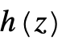$ such that $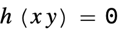$. 

1. **Polynomial Representation**:

   If $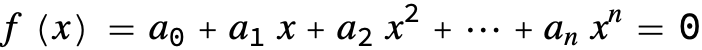$ and $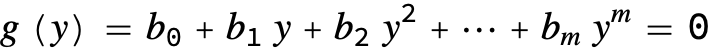$, these are polynomials with rational coefficients.

2. **Polynomial Multiplication**:

   Consider the polynomial $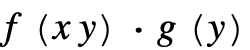$ and express it in terms of powers of $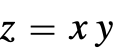$.

3. **Constructing $$**:

   Using resultant theory or elimination theory, we can find a polynomial $$ such that $$. This is a consequence of the fact that the roots of the product of polynomials (in terms of $$) will yield a polynomial whose roots include the product $$.

4. **Conclusion**:

   Since $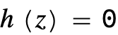$ for $$, and $$ has rational coefficients, $$ is algebraic. 

We can use  to computationally verify this in the Wolfram Language. The  of two polynomials eliminates a variable, providing a new polynomial in terms of the other variable(s).

Here's an example of how you might implement this: 
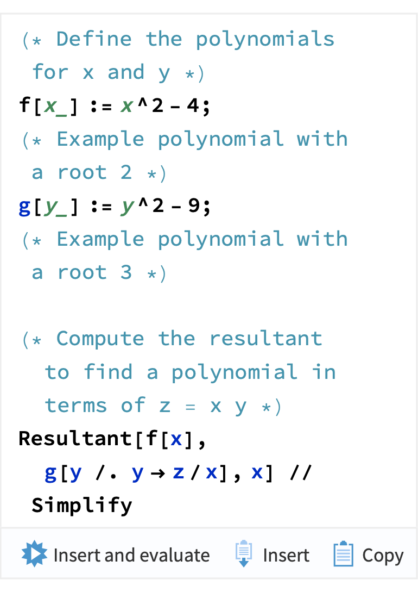
This  computation eliminates $$ and gives a polynomial in terms of $$, proving $$ is algebraic if $$ and $$ are. 

If you would like me to run this computation or explore further, just let me know!

```wl
In[]:= (* Define the polynomials for x and y *)
   Clear[x, y, z] 
    f[x_] := x^2 - 4;  (* Example polynomial with a root 2 *) 
    g[y_] := y^2 - 9;  (* Example polynomial with a root 3 *) 
    
   (* Compute the resultant to find a polynomial in terms of z = x y *) 
    Resultant[f[x], g[y /. y -> z/x], x] // Expand 
    h[z_] := 81 - (9 z^2)/2 + z^4/16; h[ 2* 3]
```

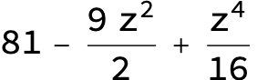

```wl
Out[]= 0
```

```wl
In[]:= Clear[x, y, z]
 f[x_] := x^2 - 4;  (* Example polynomial with a root 2 *)
 g[y_] := y^2 - 9;  (* Example polynomial with a root 3 *)
   
  (* Compute the resultant to find a polynomial in terms of z = x y *)
 Resultant[f[x], g[y], x] // Expand
```

```wl
Out[]= 81 - 18 y^2 + y^4
```